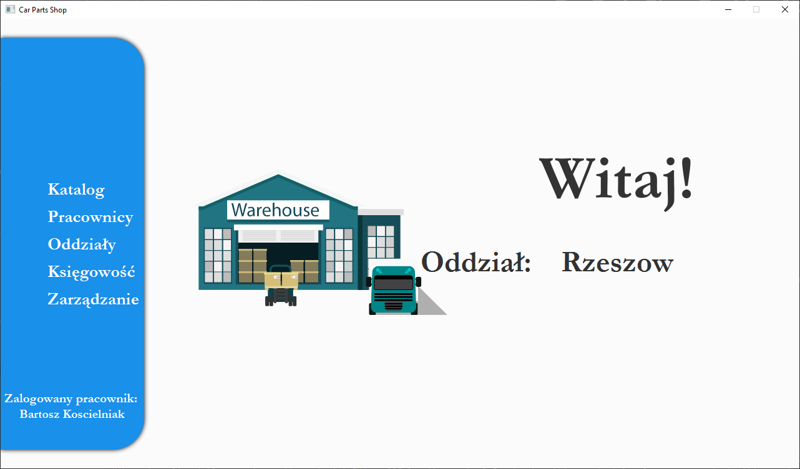
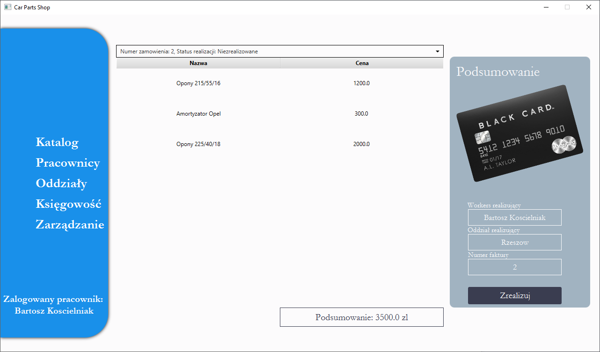

# Car Parts Shop Desktop Application
> Desktop application created to manage shop by workers.

## Table of contents
* [General info](#general-info)
* [Screenshots](#screenshots)
* [Setup](#setup)
* [Code Examples](#code-examples)  
* [Tech/framework used](#techframework-used)  
* [Status](#status)
* [Contact](#contact)
* [License](#license)

## General info
>The project was created by myself as a final paper of subject Object-Oriented Programing(OOP). Project has been realized with JavaFX and Hibernate

## Screenshots

## Setup

>Instalation of project is as simple as using it. All you had to do is download it and start with IDE, in my case **IntelliJ**.
To start application properly you need also to download database server, mine was [MySQL Community Server](https://dev.mysql.com/downloads/mysql/), and properly configure it.
After configuration you need to create database **carpartsshop**.
Start application twice so it is ready to use.

## Code Examples
Show examples of usage:

            @Override
            public void updateItem(String item, boolean empty) {
                super.updateItem(item, empty);
                if (empty) {
                    setGraphic(null);
                    setText(null);
                } else {
                    CarParts carParts = getTableView().getItems( ).get( getIndex());
                    CarParts temp = session.get( CarParts.class, carParts.getId_part() );
                    setText( temp.getKategoria().getCategory_name() );
                }
            }
        };
        return cell;
    } };

           public Session getSession() {
                Configuration configuration =new Configuration().configure("hibernate.cfg.xml");
                configuration.addAnnotatedClass(CarParts.class);
                configuration.addAnnotatedClass(Category.class);
                configuration.addAnnotatedClass(Shop.class);
                configuration.addAnnotatedClass(Workers.class);
                configuration.addAnnotatedClass(Order.class);
                ServiceRegistry serviceRegistry =new StandardServiceRegistryBuilder().applySettings(configuration.getProperties()).build();
                SessionFactory factory = configuration.buildSessionFactory(serviceRegistry);
                Session session = factory.openSession();
        
                return session;
    }

            addButton.setOnAction(event -> {
                if(!insertPrice.getText().isEmpty() || !insertAmount.getText().isEmpty() || !insertName.getText().isEmpty() || !insertSerialNumber.getText().isEmpty()){
                    Transaction transaction = session.beginTransaction();
                    CarParts tempCze = new CarParts( insertName.getText(), Long.parseLong( insertSerialNumber.getText() ), Float.parseFloat( insertPrice.getText() ), Integer.parseInt( insertAmount.getText() ), "Dostepny" );
                    Category tempKat = session.get( Category.class, category.get( chooseCategory.getSelectionModel().getSelectedIndex() ).getId_cat());
                    tempCze.setKategoria( tempKat );
                    session.save( tempCze  );
                    transaction.commit();
    } } );

## Tech/framework used

* Java 15
* Hibernate 5.4.25.Final
* CSS
* MYSQL

## Status
Project is: _in progress_ :monocle_face:

## Contact
Created by [@Bartosz Koscielniak](https://github.com/BartoszKoscielniak) - feel free to contact me! :+1:

## License
[MIT](https://choosealicense.com/licenses/mit/) ©

